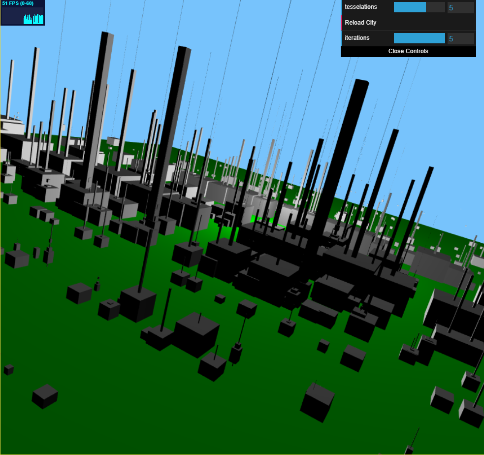

# Project 5: Shape Grammar

For this assignment you'll be building directly off of the L-system code you
wrote last week.

**Goal:** to model an urban environment using a shape grammar.

**Note:** We’re well aware that a nice-looking procedural city is a lot of work for a single week. Focus on designing a nice building grammar. The city layout strategies outlined in class (the extended l-systems) are complex and not expected. We will be satisfied with something reasonably simple, just not a uniform grid!

## Symbol Node (5 points)
Modify your symbol node class to include attributes necessary for rendering, such as
- Associated geometry instance
- Position
- Scale
- Anything else you may need

## Grammar design (55 points)
- Design at least five shape grammar rules for producing procedural buildings. Your buildings should vary in geometry and decorative features (beyond just differently-scaled cubes!). At least some of your rules should create child geometry that is in some way dependent on its parent’s state. (20 points)
    - Eg. A building may be subdivided along the x, y, or z axis into two smaller buildings
    - Some of your rules must be designed to use some property about its location. (10 points)
    - Your grammar should have some element of variation so your buildings are non-deterministic.  Eg. your buildings sometimes subdivide along the x axis, and sometimes the y. (10 points)   
- Write a renderer that will interpret the results of your shape grammar parser and adds the appropriate geometry to your scene for each symbol in your set. (10 points)

## Create a city (30 points)
- Add a ground plane or some other base terrain to your scene (0 points, come on now)
- Using any strategy you’d like, procedurally generate features that demarcate your city into different areas in an interesting and plausible way (Just a uniform grid is neither interesting nor plausible). (20 points)
    - Suggestions: roads, rivers, lakes, parks, high-population density
    - Note, these features don’t have to be directly visible, like high-population density, but they should somehow be visible in the appearance or arrangement of your buildings. Eg. High population density is more likely to generate taller buildings
- Generate buildings throughout your city, using information about your city’s features. Color your buildings with a method that uses some aspect of its state. Eg. Color buildings by height, by population density, by number of rules used to generate it. (5 points)
- Document your grammar rules and general approach in the readme. (5 points)
- ???
- Profit.

## Make it interesting (10)
Experiment! Make your city a work of art.

## Warnings:
If you're not careful with how many draw calls you make in a single `tick()`,
you can very easily blow up your CPU with this assignment. As with the L-system,
try to group geometry into one VBO so the run-time of your program outside of
the time spent generating the city is fast.

## Suggestions for the overachievers:
Go for a very high level of decorative detail!
Place buildings with a strategy such that buildings have doors and windows that are always accessible.
Generate buildings with coherent interiors
If dividing your city into lots, generate odd-shaped lots and create building meshes that match their shape .i.e. rather than working with cubes, extrude upwards from the building footprints you find to generate a starting mesh to subdivide rather than starting with platonic geometry.

## READ-ME
For my city, I mostly went off the L System code I had written for HW4 and from projects made in CIS700 (Procedural Graphics) from last year.  For building placement, I generated random positons within the given plane and placed an initial shape in that location.  From that position, a single shape could expand to more complicated building shapes.  
I have a few different grammar rules that do some variations of similar actions.  Given a single cube, two cubes may be generated jutting out from its side (in the x or z direction).  Additionally, a cube may generate out from the top of the current cube.  For a longer rectangular cube, A regular sized cube may be generated at its top.  These simple rules build together to create more interesting and complicated building shapes.

